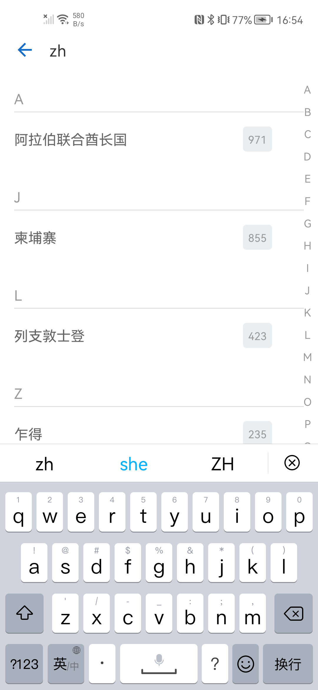

# DLSideBar
简单易用的SideBar 快速定位侧边栏A~Z 仿微信国家或地区代码选择 `jetpack compose`版本

# 截图


# 使用说明
1. Add the JitPack repository to your build file
```groovy
allprojects {
    repositories {
        maven { url 'https://jitpack.io' }
    }
}
```
2. Add the dependency
```groovy
dependencies {
        implementation 'com.github.D10NGYANG:DLSideBar_Compose:1.0.0'
}
```
3. 在你的UI页面中使用
```kotlin
val scope = rememberCoroutineScope()
SideBar(
    onSelect = { value ->
        // 选中字符，如"A"
        val index = dataList.indexOfFirst { it.py[0].uppercase() == value }
        if (index >= 0) {
            scope.launch { listState.scrollToItem(index) }
        }
    }
) {
    // 列表
    LazyColumn(
        modifier = Modifier.fillMaxSize(),
        state = listState
    ) {
        itemsIndexed(dataList) { index, item ->
            // todo 单项UI
        }
    }
}
```
4. 更多参数说明

```kotlin
@ExperimentalComposeUiApi
@Composable
fun SideBar(
    // 列表中显示的字符列表
    chars: String = "ABCDEFGHIJKLMNOPQRSTUVWXYZ#",
    // 选中字符后返回该字符
    onSelect: (String) -> Unit,
    // 触摸列表时，列表的颜色，不触摸列表时，颜色透明
    touchColor: Color = Color(0xFFEBEEF0),
    // 列表中字符的样式
    charText: @Composable (String) -> Unit = {
        DefaultSideBarCharText(text = it)
    },
    // 选中字符弹出的样式
    selectText: @Composable BoxScope.(String) -> Unit ={
        DefaultSideBarSelectText(text = it)
    },
    // 列表内容
    content: @Composable BoxScope.() -> Unit
)
```
5. 混淆
```properties
-keep class com.d10ng.sidebar.** {*;}
-dontwarn com.d10ng.sidebar.**
```